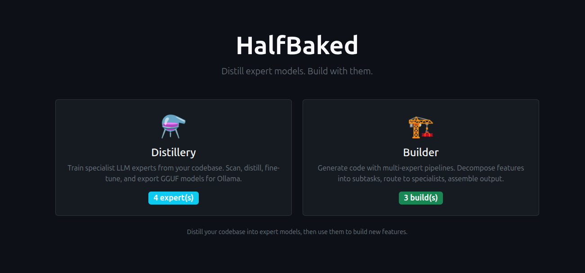

# HalfBaked

Codebase-aware code generation CLI + **Distillery** — train specialist GGUF models from any codebase.



## Requirements

- PHP 8.1+ with `curl`, `pdo_sqlite` extensions
- Composer
- Python 3.12+ (for training pipeline)
- NVIDIA GPU with CUDA support (for QLoRA training)
- [Ollama](https://ollama.ai) (for serving trained models)

## Installation

```bash
git clone https://github.com/user/halfbaked.git
cd halfbaked
composer install
```

### Training Environment Setup

The Distillery uses Python for code extraction, dataset generation, and QLoRA training. Run the setup script to create a virtual environment with all dependencies:

```bash
./training/setup-venv.sh
```

This installs:
- `anthropic` SDK (for Claude-powered dataset generation)
- `unsloth` + `xformers` + `trl` + `peft` + `accelerate` + `bitsandbytes` + `torchvision` (for QLoRA training)
- Applies the `sanitize_logprob` patch to `unsloth_zoo` (required — unsloth references this function but doesn't ship it)

**Known issue**: `trl` must be pinned to `0.23.0`. Version 0.24.0+ causes a `KeyError: 'sanitize_logprob'` in unsloth's RL module. The setup script handles this automatically.

**Manual setup** (if you prefer not to use the script):

```bash
cd training
python3 -m venv .venv
source .venv/bin/activate
pip install anthropic>=0.39.0
pip install "unsloth[colab-new] @ git+https://github.com/unslothai/unsloth.git"
pip install xformers trl==0.23.0 peft accelerate bitsandbytes torchvision

# Required patch — add sanitize_logprob stub to unsloth_zoo:
cat >> .venv/lib/python3.*/site-packages/unsloth_zoo/rl_replacements.py << 'EOF'

# Patch: stub for sanitize_logprob (referenced by unsloth but missing from zoo)
def _sanitize_logprob(logprob):
    """Clamp logprobs to prevent -inf/nan from corrupting loss."""
    import torch
    return torch.clamp(logprob, min=-1e4)
RL_REPLACEMENTS["sanitize_logprob"] = _sanitize_logprob
EOF
```

The distillery auto-detects the venv at `training/.venv/bin/python3`. You can override it via the Settings UI (Python Path) or the `HALFBAKED_PYTHON` environment variable.

## Distillery

Train specialist LLM models from any codebase. Give it a GitHub repo or local path, and it produces a fine-tuned GGUF model registered in Ollama.

**Pipeline**: Clone → Detect Language → Extract Code Samples → Generate Training Dataset (via Claude API) → QLoRA Fine-tune → Export GGUF → Register in Ollama

### Quick Start (Web UI)

```bash
php bin/halfbaked distill serve --port=8484
# Open http://127.0.0.1:8484
```

The wizard walks you through: source repo, language detection, model size selection, and kicks off training.

### Quick Start (CLI)

```bash
# Create and start distillation
php bin/halfbaked distill create https://github.com/user/project --name=my-expert --model-size=1.5b

# Monitor progress
php bin/halfbaked distill status <id>
php bin/halfbaked distill logs <id>

# List all experts
php bin/halfbaked distill list

# Import an existing model
php bin/halfbaked distill import my-model --ollama=my-model --language=php --framework="FlightPHP"
```

### Model Sizes

| Size | GGUF (Q8) | VRAM  | Best For | Experts in 24GB |
|------|-----------|-------|----------|-----------------|
| 0.5B | ~0.5 GB  | ~1 GB | Autocomplete, snippets | ~48 |
| 1.5B | ~1.6 GB  | ~2 GB | Templates, CRUD, scaffolding | ~15 |
| 3B   | ~3.3 GB  | ~4 GB | General code generation | ~7 |
| 7B   | ~7.5 GB  | ~8 GB | Business logic, complex features | ~3 |

### Dataset Generation Providers

The distillery supports multiple LLM providers for generating training data:

- **Anthropic** (default) — Claude API, highest quality (~$3-8 per expert)
- **OpenAI-compatible** — Works with Ollama, OpenRouter, Together, Groq, OpenAI

Configure via Settings in the web UI, or pass flags to the CLI.

### Importing Existing Models

Already have a trained GGUF? Import it into the registry:

```bash
php bin/halfbaked distill import voidlux-coder \
  --ollama=voidlux-coder \
  --gguf=/path/to/model-Q8_0.gguf \
  --source=/path/to/source-repo \
  --language=php \
  --framework="FlightPHP, RedBeanPHP" \
  --model-size=7b \
  --base-model="unsloth/Qwen2.5-Coder-7B-Instruct" \
  --samples=7457 \
  --dataset=326
```

## Code Generation

Use trained models for codebase-aware code generation:

```bash
# Generate with Ollama
php bin/halfbaked generate "Add a product search endpoint" --path=/my/project --model=my-expert

# Generate directly with GGUF (no Ollama needed)
php bin/halfbaked generate "Add a product search endpoint" --backend=gguf --gguf=/path/to/model.gguf
```

## CLI Reference

```
halfbaked generate <task>              Generate code with codebase context
halfbaked distill serve [--port=8484]  Start the Distillery web UI
halfbaked distill create <source>      Train a new expert from a repo
halfbaked distill import <name>        Import an existing GGUF model
halfbaked distill list                 List all expert models
halfbaked distill status <id>          Show expert details
halfbaked distill logs <id>            View training logs
halfbaked distill remove <id>          Remove an expert and its GGUF
halfbaked models                       List available Ollama models
halfbaked check                        Verify model availability
halfbaked scan --path=<dir>            Show project files
```
# halfbaked
